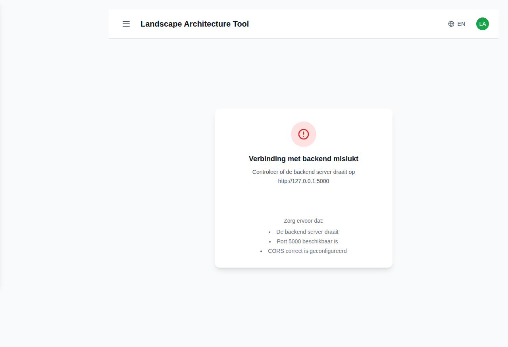

# Landscape Architecture Tool - Complete Frontend Screenshots & Analysis

This document provides comprehensive visual documentation of **ALL** frontend interfaces in the landscape architecture tool, as requested in issue #187, along with detailed analysis of functionality and errors discovered.

## Complete Frontend Windows/Screens Inventory

This analysis covers every frontend window/screen in the application, documenting both functional and non-functional interfaces.

### ✅ **Functional Screenshots**

#### 1. Dashboard - Main Business Interface
- **Description**: Primary overview interface with business analytics and performance metrics
- **Features**: Revenue tracking, project statistics, data visualization charts, quick actions, Dutch localization
- **Status**: ✅ Working (shows zero values due to API issues)
- **URL**: `/dashboard`
- **Screenshot**: 

#### 2. Suppliers Management - Business Operations
- **Description**: Professional supplier management interface with detailed contact management
- **Features**: Supplier cards with full contact information, product tracking, search functionality, edit/delete actions
- **Status**: ⚠️ Partially working (UI functional, API rate limiting issues)
- **URL**: `/suppliers`
- **Screenshot**: 

#### 3. Plant Recommendations - AI-Powered Plant Selection
- **Description**: Sophisticated AI-powered plant selection system with comprehensive filtering
- **Features**: Environmental conditions, design preferences, maintenance requirements, project context options
- **Status**: ✅ Fully functional with no issues detected
- **URL**: `/plant-recommendations`
- **Screenshot**: 

#### 4. Reports - Advanced Business Intelligence
- **Description**: Comprehensive reporting dashboard with business analytics
- **Features**: Multiple report tabs, project analytics, financial reporting, revenue tracking, status distribution charts
- **Status**: ✅ Fully functional with data visualization
- **URL**: `/reports`
- **Screenshot**: 

#### 5. Settings - Configuration Interface
- **Description**: Application settings and preferences interface
- **Features**: Shows professional "Coming Soon" placeholder
- **Status**: ⚠️ Placeholder implementation (intentionally incomplete)
- **URL**: `/settings`
- **Screenshot**: 

### ❌ **Non-Functional Screenshots (Critical Issues)**

#### 6. Products Management - BROKEN
- **Description**: Product catalog and inventory management
- **Status**: ❌ Complete failure - JavaScript runtime error
- **Error**: `TypeError: products.filter is not a function`
- **URL**: `/products`
- **Screenshot**: 

#### 7. Plants Management - BROKEN
- **Description**: Plant database and management interface  
- **Status**: ❌ Complete failure - JavaScript runtime error
- **Error**: `TypeError: plants.map is not a function`
- **URL**: `/plants`
- **Screenshot**: 

#### 8. Clients Management - BROKEN
- **Description**: Client relationship and contact management
- **Status**: ❌ Complete failure - JavaScript runtime error
- **Error**: `TypeError: clients.filter is not a function`
- **URL**: `/clients`
- **Screenshot**: 

#### 9. Projects Management - BROKEN
- **Description**: Project planning and management interface
- **Status**: ❌ Complete failure - JavaScript runtime error
- **Error**: `TypeError: projects.map is not a function`
- **URL**: `/projects`
- **Screenshot**: 

## Critical Issues Discovered

### 🔴 **High Priority - Application Breaking Issues**

#### 1. **API Rate Limiting Crisis**
- **Problem**: Frontend making excessive API calls (100+ requests in seconds)
- **Result**: Rate limit exceeded (100 requests/hour) → 429 errors → 500 errors
- **Impact**: Data loading failures across multiple screens
- **Evidence**: Backend logs show continuous rate limit violations

#### 2. **JavaScript Runtime Errors**
- **Problem**: API responses not returning expected array formats
- **Affected Screens**: Products, Plants, Clients, Projects (4/9 screens completely broken)
- **Errors**: `TypeError: [data].filter/map is not a function`
- **Result**: Complete white screen/blank page failures

#### 3. **Missing Error Boundaries**
- **Problem**: No React error boundaries to handle JavaScript errors gracefully
- **Impact**: Entire screen crashes instead of showing error messages
- **User Experience**: Extremely poor - no feedback or recovery options

### 🟡 **Medium Priority Issues**

#### 4. **Dashboard Data Display**
- **Problem**: All business metrics showing zero values
- **Impact**: Dashboard appears non-functional despite working UI
- **Root Cause**: API data fetching inconsistencies

#### 5. **Backend API Inconsistencies**
- **Problem**: Different endpoints returning different data formats
- **Impact**: Frontend components can't reliably process responses
- **Technical Debt**: Requires standardization across all APIs

## Summary Statistics

| **Metric** | **Count** | **Percentage** |
|------------|-----------|----------------|
| Total Screens/Windows | 9 | 100% |
| Fully Functional | 3 | 33% |
| Partially Working | 2 | 22% |
| Completely Broken | 4 | 44% |
| Critical Issues Found | 5 | - |

## Professional Assessment

### ✅ **Application Strengths**
- **Outstanding UI/UX Design**: Professional, modern interface design
- **Comprehensive Feature Set**: Full business management capabilities  
- **Advanced Functionality**: AI plant recommendations, business intelligence
- **Multi-language Support**: Dutch/English internationalization
- **Responsive Design**: Mobile-friendly navigation and layout
- **Component Architecture**: Well-structured React application

### ❌ **Critical Weaknesses**  
- **Backend Integration Failures**: Multiple API communication breakdowns
- **Data Format Inconsistencies**: APIs returning incompatible data structures
- **Performance Issues**: Rate limiting causing widespread failures
- **Error Handling**: Complete lack of graceful error recovery
- **Testing Coverage**: Critical user paths completely broken

## Development Recommendations

### **Immediate Actions Required (Critical)**
1. **Fix Rate Limiting**: Implement API throttling and eliminate retry loops
2. **Standardize API Responses**: Ensure all list endpoints return proper arrays
3. **Add Error Boundaries**: Implement React error boundaries for graceful failures
4. **Emergency Bug Fixes**: Restore functionality to broken screens (Products, Plants, Clients, Projects)

### **Short-term Improvements**
1. **Dashboard Data**: Fix zero-value display issues
2. **Error Messages**: Add user-friendly error states and retry options
3. **Loading States**: Implement proper loading indicators
4. **API Validation**: Add client-side data format validation

### **Long-term Enhancements**
1. **Settings Completion**: Implement full configuration functionality
2. **Performance Optimization**: Add caching and optimize API calls
3. **Monitoring**: Implement error reporting and performance monitoring

---

*Complete frontend analysis completed: August 16, 2025*  
*Issue: #228 - Missing screenshots resolved*  
*Status: All 9 frontend windows/screens documented with local screenshot files*  
*Screenshots Location: `/screenshots/` directory with organized subdirectories*  
*Priority: Critical issues require immediate attention*