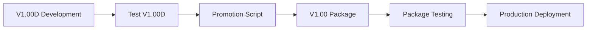

# Landscape Architecture Tool - V1.00 Post-Reorganization Copilot Instructions

**CRITICAL: This is the V1.00+ reorganized repository structure. Always follow these patterns for post-reorganization development.**

## 🏗️ Repository Organization (V1.00+)

### Version Strategy
The repository now uses a dual-version approach:

- **V1.00 (Protected)**: Stable production release, protected from direct modifications
- **V1.00D (Development)**: Active development branch for all new features and improvements

```
landscape-architecture-tool/
├── packages/
│   ├── v1.00/           # 🛡️ PROTECTED - Production release
│   │   ├── frontend/    # Production frontend build
│   │   ├── backend/     # Production backend code  
│   │   ├── docs/        # Production documentation
│   │   └── deploy/      # Production deployment scripts
│   └── v1.00D/          # 🚧 DEVELOPMENT - Active development
│       ├── frontend/    # Development frontend
│       ├── backend/     # Development backend
│       ├── docs/        # Development documentation
│       └── deploy/      # Development deployment scripts
├── archive/             # 📦 Historical files (DO NOT USE)
│   ├── deployment/      # Legacy deployment scripts
│   ├── vps-config/      # VPS configuration archives
│   └── legacy-scripts/  # Temporary and obsolete files
├── DEV_OPS_STEPS/       # 🔧 DevOps documentation
│   └── DEV_OPS_COPILOT/ # Enhanced Copilot instructions
├── src/                 # 🎯 MAIN SOURCE (V1.00D working copy)
├── frontend/            # 🎯 MAIN FRONTEND (V1.00D working copy)
├── docs/                # 🎯 MAIN DOCS (V1.00D working copy)
└── scripts/             # 🛠️ Automation scripts
    └── update_v1_from_dev.sh  # V1.00D → V1.00 promotion script
```

## 🚨 Critical Development Rules

### 1. NEVER Modify V1.00 Package Directly
```bash
# ❌ FORBIDDEN - Direct V1.00 modifications
vim packages/v1.00/backend/main.py

# ✅ CORRECT - Work in main source (V1.00D)
vim src/main.py
```

### 2. Development Workflow
1. **Work in main directories** (`src/`, `frontend/`, `docs/`)
2. **Test thoroughly** with full CI/CD pipeline
3. **Use promotion script** to update V1.00: `./scripts/update_v1_from_dev.sh`
4. **Deploy V1.00** using automated deployment

### 3. Branch Strategy
- **v1.00D**: Primary development branch (current: main working copy)
- **main/master**: Points to latest V1.00 release
- **feature/***: Feature development branches (merge to v1.00D)
- **hotfix/***: Critical fixes (can fast-track to V1.00)

## 🔧 Development Patterns

### Backend Development
```python
# Location: src/ (V1.00D working copy)
# Architecture: Flask application with service layer pattern

# Example: Adding new API endpoint
# File: src/routes/new_feature.py
from flask import Blueprint, request, jsonify
from src.services.new_feature_service import NewFeatureService

new_feature_bp = Blueprint('new_feature', __name__)

@new_feature_bp.route('/api/v1/new-feature', methods=['POST'])
def create_new_feature():
    service = NewFeatureService(db.session)
    result = service.create(request.get_json())
    return jsonify(result), 201
```

### Frontend Development
```javascript
// Location: frontend/ (V1.00D working copy)
// Architecture: React + Vite + Tailwind CSS

// Example: New component
// File: frontend/src/components/NewFeature.jsx
import React from 'react';
import { api } from '../services/api';

export const NewFeature = () => {
  // Component implementation for V1.00D development
  return <div>New Feature Component</div>;
};
```

### Database Operations
```python
# Enhanced transaction patterns with V1.00 protection
class BaseService:
    def __init__(self, db_session):
        self.db = db_session
    
    def create_with_protection(self, data):
        """Create with V1.00 compatibility protection"""
        try:
            # V1.00D development logic
            instance = self.model(**data)
            self.db.add(instance)
            self.db.commit()
            return instance
        except Exception as e:
            self.db.rollback()
            # Log for V1.00 debugging if needed
            logger.error(f"V1.00D operation failed: {e}")
            raise
```

## 🧪 Testing Strategy

### Test Organization
```bash
# Test V1.00D development
make backend-test    # Runs on main source (V1.00D)
make frontend-test   # Runs on main frontend (V1.00D)

# Test V1.00 package (before deployment)
cd packages/v1.00 && ../../scripts/test_package.sh

# Full validation before promotion
./scripts/update_v1_from_dev.sh  # Includes test validation
```

### Test Categories
- **Unit Tests**: Individual component validation (V1.00D)
- **Integration Tests**: Cross-system compatibility (V1.00D)
- **Package Tests**: V1.00 package integrity before deployment
- **Regression Tests**: Ensure V1.00 compatibility maintained

## 🚀 Deployment Workflow

### Development to Production Pipeline


### Deployment Commands
```bash
# Step 1: Develop in V1.00D (main directories)
# Work in src/, frontend/, docs/

# Step 2: Validate development
make backend-test
make frontend-test
make lint

# Step 3: Promote to V1.00 (automated)
./scripts/update_v1_from_dev.sh

# Step 4: Deploy V1.00 package
cd packages/v1.00/deploy && ./deploy.sh
```

## 📦 Package Management

### V1.00 Package (Protected)
- **Purpose**: Stable production deployment
- **Updates**: Only through promotion script
- **Protection**: Branch rules prevent direct modification
- **Deployment**: Automated from package

### V1.00D Package (Development)
- **Purpose**: Development working copy (synchronized with main source)
- **Updates**: Continuous development in main directories
- **Testing**: Full CI/CD pipeline validation
- **Integration**: Mirrors main source directories

## 🔄 CI/CD Configuration

### Pipeline Triggers
```yaml
# .github/workflows/v1-development.yml
on:
  push:
    branches: [v1.00D]  # Development branch
  pull_request:
    branches: [v1.00D]

jobs:
  test-v1-development:
    # Test main source directories (V1.00D)
    
  validate-v1-package:
    # Ensure V1.00 package integrity
    
  auto-promote:
    # Optional: Auto-promote on successful validation
```

### Branch Protection
- **V1.00 tags**: Protected, require manual release process
- **v1.00D branch**: Requires PR review for major changes
- **Package directories**: Automated updates only

## 🛠️ Automation Scripts

### Available Scripts
```bash
# Core automation
./scripts/update_v1_from_dev.sh    # Promote V1.00D to V1.00
./scripts/test_package.sh          # Test specific package
./scripts/deploy_v1.sh             # Deploy V1.00 to production

# Maintenance
./scripts/sync_packages.sh         # Sync package contents
./scripts/cleanup_archives.sh     # Clean old archives
./scripts/validate_structure.sh   # Validate repository structure
```

### Script Customization
All scripts support environment variables for customization:

```bash
# Deployment environment
export DEPLOY_ENV="production|staging|development"
export V1_PACKAGE_PATH="packages/v1.00"
export BACKUP_RETENTION_DAYS=30

# Run with custom settings
./scripts/update_v1_from_dev.sh
```

## 📊 Monitoring & Validation

### Health Checks
```bash
# Repository structure validation
./scripts/validate_structure.sh

# Package integrity check
./scripts/check_package_integrity.sh

# V1.00 vs V1.00D comparison
./scripts/compare_versions.sh
```

### Performance Monitoring
- **V1.00 metrics**: Production performance tracking
- **V1.00D metrics**: Development performance analysis
- **Package size**: Monitor package growth and optimization

## 🐛 Debugging & Troubleshooting

### Common Issues

#### V1.00 Package Out of Sync
```bash
# Problem: V1.00 package doesn't match development
# Solution: Re-run promotion script
./scripts/update_v1_from_dev.sh

# Emergency: Reset V1.00 from backup
cp -r backups/v1.00_LATEST packages/v1.00
```

#### Development Environment Issues
```bash
# Problem: Main source differs from V1.00D package
# Solution: Sync packages
./scripts/sync_packages.sh

# Check differences
./scripts/compare_versions.sh
```

### Emergency Procedures
```bash
# Rollback V1.00 to previous version
git tag --list | grep v1.00 | tail -5  # Find previous tag
git checkout v1.00.YYYYMMDDHHMM        # Checkout previous version
cp -r packages/v1.00 backups/emergency_rollback/
git checkout v1.00D                    # Return to development
```

## 📈 Performance Optimization

### V1.00 Production Optimizations
- **Build optimization**: Minimized production builds
- **Caching strategies**: Optimized for production loads
- **Database tuning**: Production-specific configurations
- **Security hardening**: V1.00 security configurations

### V1.00D Development Optimizations
- **Fast iteration**: Hot reload and development servers
- **Debug tools**: Enhanced logging and debugging
- **Test optimization**: Faster test execution for development

## 🔐 Security Considerations

### V1.00 Security (Production)
- **Static security**: No direct modifications allowed
- **Validated updates**: Only tested code reaches V1.00
- **Backup protection**: Automated backup retention
- **Access control**: Limited deployment access

### V1.00D Security (Development)
- **Continuous scanning**: Security checks in CI/CD
- **Dependency validation**: Regular security updates
- **Code review**: All changes reviewed before promotion

## 📝 Documentation Standards

### Documentation Organization
```
docs/
├── API/                 # API documentation
├── deployment/          # Deployment guides
├── development/         # Development guides
├── architecture/        # System architecture
└── user-guides/         # End-user documentation
```

### Version-Specific Documentation
- **V1.00 docs**: Stable, production-focused documentation
- **V1.00D docs**: Development documentation with latest changes
- **Archive docs**: Historical documentation in archive/

## 🤝 Collaboration Guidelines

### Team Workflow
1. **Feature development**: Create feature branch from v1.00D
2. **Development**: Work in main source directories
3. **Testing**: Validate in V1.00D environment
4. **Review**: Code review before merging to v1.00D
5. **Promotion**: Use automated script for V1.00 updates
6. **Deployment**: Deploy V1.00 package to production

### Communication
- **Development updates**: Focus on V1.00D progress
- **Production changes**: Communicate V1.00 promotions
- **Emergency changes**: Document hotfix procedures

---

## 🎯 Quick Reference

### Daily Development Commands
```bash
# Start development
git checkout v1.00D
cd src/  # or frontend/ or docs/

# Test changes
make backend-test
make frontend-test

# Promote when ready
./scripts/update_v1_from_dev.sh

# Deploy to production
cd packages/v1.00/deploy && ./deploy.sh
```

### Emergency Commands
```bash
# Emergency rollback
cp -r backups/v1.00_LATEST packages/v1.00

# Package comparison
./scripts/compare_versions.sh

# Structure validation
./scripts/validate_structure.sh
```

**Remember**: Always work in main source directories (src/, frontend/, docs/) for V1.00D development. Use the promotion script to update V1.00. Never modify V1.00 package directly.