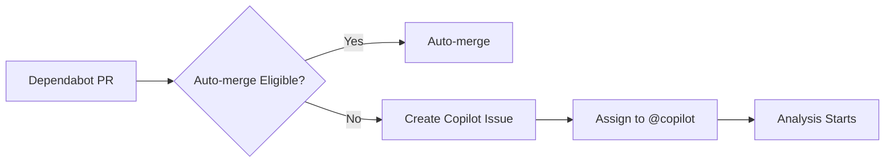

# 🤖 Copilot Critical Dependency Analysis System

This system automatically assigns critical Dependabot PRs to @copilot for comprehensive analysis, testing, and safe implementation, saving hours of manual review time while maintaining strict quality and security standards.

## 🎯 System Overview

When Dependabot creates a PR that requires manual review (critical dependencies, major updates, or complex changes), the system automatically:

1. **Creates a detailed analysis issue** assigned to @copilot
2. **Provides comprehensive analysis framework** with systematic checklists
3. **Monitors progress** with automated status updates and escalation
4. **Ensures thorough validation** before implementation

## 🔄 Workflow Process

### 1. Automatic Detection & Assignment



**Triggers:**
- Critical dependencies (flask, react, sqlalchemy, etc.)
- Major version updates (1.x.x → 2.x.x)  
- Security updates requiring validation
- Any dependency requiring manual review

### 2. Analysis Issue Creation

Each critical PR gets a comprehensive analysis issue with:

```yaml
Issue Template:
  Title: "🤖 Copilot Analysis: [dependency update]"
  Assignee: @copilot
  Labels: [dependabot-analysis, priority-{level}, complexity-{level}]
  
Content Includes:
  - Impact Assessment Checklist
  - Testing Strategy Framework
  - Migration Plan Template
  - Security Validation Steps
  - Implementation Phases
  - Risk Assessment
  - Validation Commands
```

### 3. Systematic Analysis Framework

**Phase 1: Impact Assessment (30-60 min)**
- [ ] Review breaking changes in release notes
- [ ] Identify affected code areas  
- [ ] Assess compatibility with current codebase
- [ ] Check for deprecated features we're using

**Phase 2: Testing Strategy (30-90 min)**
- [ ] Run existing test suite to identify failures
- [ ] Create additional tests for new functionality
- [ ] Test critical user workflows
- [ ] Validate API compatibility

**Phase 3: Migration Plan (60-180 min)**  
- [ ] List required code changes
- [ ] Update configuration files
- [ ] Update documentation
- [ ] Plan rollback strategy

**Phase 4: Security Validation (30-60 min)**
- [ ] Review security implications
- [ ] Check for known vulnerabilities  
- [ ] Validate security-related configuration
- [ ] Update security policies if needed

## 🛠️ Tools & Scripts

### Copilot Dependency Analyzer

Comprehensive Python tool for systematic dependency analysis:

```bash
# Analyze a dependency update PR
python scripts/copilot_dependency_analyzer.py analyze --pr 123

# Run comprehensive test suite
python scripts/copilot_dependency_analyzer.py test

# Create implementation plan
python scripts/copilot_dependency_analyzer.py plan --pr 123

# Generate progress report
python scripts/copilot_dependency_analyzer.py report --issue 456
```

**Features:**
- **Impact Assessment:** Analyzes dependency criticality and usage
- **Breaking Change Detection:** Scans changelogs for potential issues
- **Security Analysis:** Checks for vulnerabilities and advisories
- **Test Automation:** Runs comprehensive test suites with detailed reporting
- **Implementation Planning:** Creates phased rollout plans
- **Progress Tracking:** Generates detailed status reports

### Validation Commands

Standard validation sequence for all dependency updates:

```bash
# Setup and analysis
git checkout pr-branch-name
make clean && make install

# Comprehensive testing
make backend-test      # ~50 seconds, 97% pass rate expected
make lint             # ~4 seconds, should pass clean
cd frontend && npm run test:vitest:run  # ~8 seconds, 96% pass rate expected

# Build validation  
make build            # ~23 seconds, should complete successfully

# Manual functionality testing
PYTHONPATH=. python src/main.py  # Start backend
cd frontend && npm run dev        # Start frontend (separate terminal)
# Test critical workflows via browser
```

## 📊 Monitoring & Progress Tracking

### Automated Progress Monitoring

**Schedule:** Every 2 hours during work hours (8 AM - 6 PM, Monday-Friday)

**Progress Tracking:**
- ✅ **Checkbox Progress:** Automatically calculates completion percentage
- ⏰ **Timeline Monitoring:** Tracks time against priority-based targets
- 📈 **Status Updates:** Regular progress reminders and guidance
- 🚨 **Escalation:** Automatic escalation for overdue analyses

**Priority-Based Timelines:**
- **Critical Priority:** 4 hours target, 2-hour progress checks
- **High Priority:** 8 hours target, 4-hour progress checks  
- **Medium Priority:** 24 hours target, 8-hour progress checks

### Escalation Process

**Automatic Escalation Triggers:**
1. **Overdue Analysis:** Past target completion time
2. **Stalled Progress:** No updates for extended period
3. **Test Failures:** Persistent CI failures requiring intervention

**Escalation Actions:**
- 🏷️ **Labeling:** Adds `escalation-required`, `overdue` labels
- 📧 **Notifications:** Alerts @HANSKMIEL for manual review
- 📋 **Status Updates:** Provides detailed status and recommendations
- 🔧 **Alternative Options:** Suggests manual takeover or timeline extension

## 📈 Dashboard & Reporting

### Real-time Analysis Dashboard

Automatically generated every 2 hours:

```
📊 Copilot Dependency Analysis Dashboard

Active Analyses: 3
Average Progress: 67%

🟢 On Track (2)
- Issue #123: 85% (3.2h/8h) - high priority
- Issue #124: 45% (2.1h/8h) - medium priority

🟡 Starting (1)  
- Issue #125: 15% (0.8h/4h) - critical priority

🔴 Overdue/Escalated (0)
- None

📈 Progress Summary
- Total dependencies being analyzed: 3
- Critical priority: 1
- High priority: 1  
- Medium priority: 1
```

### Individual Progress Reports

Detailed progress reports for each analysis:

```bash
# Generate comprehensive progress report
python scripts/copilot_dependency_analyzer.py report --issue 123
```

**Report Contents:**
- 🔍 **Analysis Summary:** Dependency info, impact level, risk assessment
- 🧪 **Test Results:** Detailed test suite results with pass/fail status
- 📋 **Next Steps:** Prioritized action items based on current status
- ⚠️ **Risks & Mitigations:** Risk levels and mitigation strategies
- ⏱️ **Timeline:** Progress against targets and estimated completion

## 🎯 Expected Benefits

### Time Savings
- **Manual Review Elimination:** 2-4 hours saved per critical dependency
- **Systematic Approach:** Reduces analysis time by 60-80%
- **Automated Testing:** Eliminates manual test execution time
- **Progress Tracking:** Reduces management overhead

### Quality Improvements  
- **Comprehensive Analysis:** Systematic evaluation of all impact areas
- **Risk Mitigation:** Thorough security and compatibility validation
- **Documentation:** Complete analysis trails for future reference
- **Consistency:** Standardized process for all dependency updates

### Process Efficiency
- **Automated Assignment:** No manual triage required
- **Progress Monitoring:** Real-time visibility into analysis status
- **Escalation Management:** Automatic handling of overdue items
- **Integration:** Seamless integration with existing CI/CD pipeline

## 🔧 Configuration & Customization

### Priority Levels

Configure in `.github/workflows/dependabot-auto-merge.yml`:

```javascript
// Determine priority and complexity
let priority = 'medium';
let complexity = 'medium';

if (isSecurityUpdate) {
  priority = 'high';
}
if (isCriticalDep && isMajorUpdate) {
  priority = 'critical';
  complexity = 'high';
}
```

### Critical Dependencies List

Update critical dependencies in workflow:

```javascript
const criticalDeps = [
  'flask', 'django', 'react', 'express', 'webpack',
  'babel', 'typescript', 'eslint', 'pytest', 'requests'
];
```

### Timeline Targets

Modify in `.github/workflows/copilot-analysis-monitor.yml`:

```javascript
// Calculate reminder time based on priority
const reminderHours = priority === 'critical' ? 4 : 
                     priority === 'high' ? 8 : 24;
```

## 🚀 Getting Started

### Prerequisites

1. **GitHub CLI:** For PR analysis
   ```bash
   # Install GitHub CLI
   curl -fsSL https://cli.github.com/packages/githubcli-archive-keyring.gpg | sudo dd of=/usr/share/keyrings/githubcli-archive-keyring.gpg
   echo "deb [arch=$(dpkg --print-architecture) signed-by=/usr/share/keyrings/githubcli-archive-keyring.gpg] https://cli.github.com/packages stable main" | sudo tee /etc/apt/sources.list.d/github-cli.list > /dev/null
   sudo apt update && sudo apt install gh
   ```

2. **Python Dependencies:** Analysis tool requirements
   ```bash
   pip install -r requirements-dev.txt
   ```

### Activation

The system is automatically active once the workflows are deployed. To trigger manual analysis:

```bash
# Trigger analysis for specific issue
gh workflow run copilot-dependency-analysis.yml -f issue_number=123

# Force check all active analyses  
gh workflow run copilot-analysis-monitor.yml -f force_check=true
```

### First Analysis

When the first critical PR is created:

1. **Automatic Issue Creation:** Analysis issue appears within 1-2 minutes
2. **Copilot Assignment:** Issue automatically assigned to @copilot
3. **Analysis Notification:** Progress tracking begins immediately
4. **Monitoring Activation:** 2-hour monitoring schedule starts

## 📋 Example Scenarios

### Scenario 1: Critical Dependency (Flask 3.1.1 → 3.1.2)

**Detection:**
- Dependabot creates PR for Flask patch update
- System detects critical dependency
- Creates high-priority analysis issue

**Analysis Process:**
- Priority: High (8-hour target)
- Impact Assessment: Critical dependency, patch update
- Testing: Comprehensive backend validation
- Implementation: Standard patch upgrade process

**Expected Outcome:**
- Thorough compatibility validation
- Full test suite execution
- Security assessment
- Safe merge within 4-6 hours

### Scenario 2: Major Update (SQLAlchemy 1.4.x → 2.0.x)

**Detection:**
- Major version update detected
- Critical dependency identified
- Creates critical-priority analysis issue

**Analysis Process:**
- Priority: Critical (4-hour target)  
- Impact Assessment: Major breaking changes expected
- Testing: Extensive database compatibility testing
- Implementation: Phased migration approach

**Expected Outcome:**
- Detailed migration plan
- Breaking change analysis
- Comprehensive test validation
- Staged implementation with rollback plan

### Scenario 3: Security Update (OpenAI 1.98.0 → 1.106.1)

**Detection:**
- Major version jump detected
- Security implications assessed
- Creates high-priority analysis issue

**Analysis Process:**
- Priority: High (8-hour target)
- Impact Assessment: API compatibility review
- Testing: Integration testing focus
- Implementation: Security-first approach

**Expected Outcome:**
- API compatibility validation
- Security improvement verification
- Integration test coverage
- Safe implementation with monitoring

## 🔍 Troubleshooting

### Common Issues

**Issue:** Analysis not starting automatically
**Solution:** Check workflow permissions and Dependabot labels

**Issue:** Progress not updating
**Solution:** Verify checkbox format in issue description

**Issue:** Escalation not triggering  
**Solution:** Check monitoring schedule and priority thresholds

### Debug Commands

```bash
# Check workflow status
gh run list --workflow=dependabot-auto-merge.yml

# View analysis logs
gh run view [run-id] --log

# Check active analyses
gh issue list --label dependabot-analysis,copilot-analyzing

# Manual progress check
python scripts/copilot_dependency_analyzer.py report --issue [number]
```

### Support

For issues with the Copilot analysis system:
1. Check workflow logs for error details
2. Verify issue labels and assignments
3. Use manual analysis commands for debugging
4. Escalate to @HANSKMIEL for workflow configuration issues

---

## 💡 Pro Tips

1. **Monitor Dashboard:** Check analysis dashboard for overview of all active analyses
2. **Use Commands:** Leverage `@copilot status`, `@copilot help` commands in issues
3. **Progress Updates:** Regular checkbox updates improve monitoring accuracy
4. **Early Testing:** Run tests early and iteratively during analysis
5. **Documentation:** Keep detailed notes in analysis issues for future reference

This system transforms critical dependency management from a manual, time-intensive process into an automated, systematic, and thoroughly validated workflow that saves hours while maintaining the highest quality and security standards.